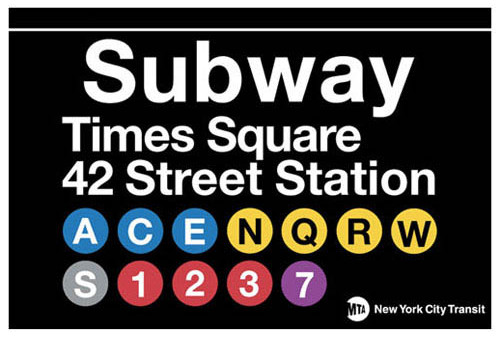

So, this is my first real attempt at building a blog from scratch.^[This site is built with GatsbyJS — it wouldn't be the snappy, well-orchestrated JS bundle you're seeing if it wasn't for such an awesome framework. I highly suggest that you check it out here if you haven't already. So, in that sense, this website is not built *from scratch* à la a blank page, but instead all of the styling and components are proprietary.] And by that, I mean not ripping somebody's template off and tweaking it until it feels vaguely where I would want it.

## A place of my own

I want to create something that has character, style. A place where I truly feel I can write my thoughts and call it 'my own work'. Therefore, I'd like this blog to be as much of a depiction and reflection of my character as it is a description of it.

All of my efforts to journal on the web have, until now, been rather paltry. I feel on reflection that this was largely due to my dissatisfaction (and misunderstanding of the workings) of my previous blog incarnations. Hopefully this one, as a labour of love, will be a place that sees a lot more fruit.

## Design inspiration

My previous blog site attempts have been extremely 'purist' in the sense that I tried to aim for an all-white canvas with minimal visual intrusion in terms of bold elements or colour. This style, rather like that of a printed page, has been done so well, but unfortunately too many times that it is now ubiquitous with almost every TechBlog™.

I'm less trying to create a personal brand, but more an appealing style to the eye that evokes visual fun from functionality. The two most relevant (to this ethos) examples of web-print style that I have come across as of late are Bloomberg.com and Wired.com. The use of block elements, bold text, colour, and brave underlining adds up to a reading experience that feels much more 'web' than many other journalistic / blog outlets manage to achieve.

So, we have a layout style, and an underlying design cue — but what about a personal twist? For that (which you may have recognised by now), I turned to the print style of the New York City Subway signage and maps. Public transport print has to be clear, recognisable, and direct. Their use of circular iconography and bold Helvetica type is laudable; I have tried to emulate that in the masthead and headings throughout the site. I'm not fully sold on my take of it yet — as perhaps it is a little too confusing from being a bit too *metro*; but maybe a successor style can evolve out of it.

*A typical NYC subway sign — source: a856-citystore.nyc.gov*
